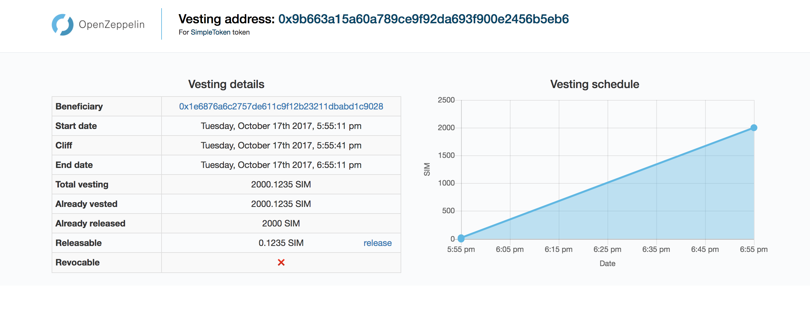

# Token Vesting Dapp

Web-based GUI to interact with the [Token Vesting contract](https://github.com/singnet/core/blob/master/contracts/tokens/TokenVesting.sol) provided by the [OpenZeppelin](https://openzeppelin.org) [library](https://github.com/OpenZeppelin/zeppelin-solidity).

### Build

Builds distributable in "./build" directory

`npm run build`

### Deploy
In the root folder

`aws s3 cp build s3://<bucket-name> --recursive`

### Live!
Go to `http://vesting.singularitynet.io/<token-vesting-address>` and interact with the contract!
